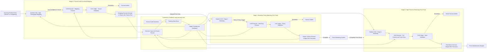

```mermaid
flowchart LR
    A["Incoming Product Pairs (Vendor vs Competitor)"] --> M1

    subgraph P1["Stage 0: Physical and Functional Mapping"]
        M1["Student VLM - High Throughput Mapping"]
        M1 -->|"Low Confidence or Novel"| MX["VLM Executor - Mapping Clauses"]
        MX --> MJ["VLM Judge - Clause Validation"]
        MJ -->|"Escalation"| MH["Human Auditor"]
        MJ --> MOUT["Mapping Decision (Accept or Reject with Clause IDs)"]
    end

    MOUT -->|"Mapped Pairs Only"| P2

    subgraph P2["Stage 1: Business Policy Matching (Pre-Price)"]
        S1["Student VLM - Stage 1 Matching"]
        S1 -->|"Risk or Policy Trigger"| SX["VLM Executor - Matching Clauses"]
        SX --> SJ["VLM Judge - Policy Validation"]
        SJ -->|"Escalation"| SH["Human Auditor"]
        SJ --> SOUT1["Stage 1 Match Decision (Target 94% Precision)"]
    end

    SOUT1 -->|"Accepted"| MON["Price Monitoring System"]

    MON -->|"Competitor Price Drops"| P3

    subgraph P3["Stage 2: High Precision Matching (Post-Price)"]
        S2["Student VLM - Stage 2 Matching"]
        S2 --> HX["VLM Executor - Full Clauses and Fresh Data"]
        HX --> HJ["VLM Judge - Strict Validation"]
        HJ -->|"Escalation"| HH["Senior Human Auditor"]
        HJ --> SOUT2["Final Match Decision (Target 96% Precision)"]
    end

    SOUT2 --> PRICE["Price Determination Engine"]

    subgraph FB["Continuous Feedback and Learning Loop"]
        LOG["Decision Logs and Clause Results"]
        AUDIT["Human Audit Outcomes"]
        LOG --> DATA["Training Data Store"]
        AUDIT --> DATA
        DATA --> TRAIN["Model Training and Distillation"]
        TRAIN --> M1
        TRAIN --> S1
        TRAIN --> S2
        TRAIN --> MX
        TRAIN --> SX
        TRAIN --> HX
    end

    MOUT --> LOG
    SOUT1 --> LOG
    SOUT2 --> LOG


```

